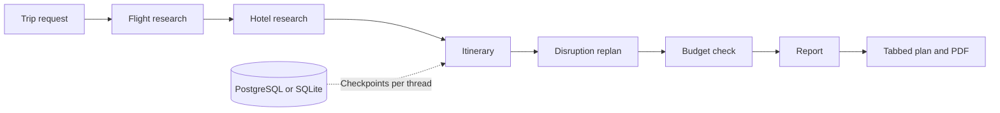

# Voyagent.

### A six-agent travel planner built with LangGraph and FastAPI.

Turn a trip request into flight research, hotel options, a daily itinerary, and a checked budget. Continue the same conversation to change the trip or plan around rain, flight delays, and cancellations.

[](https://github.com/GrrrGe/Voyagent/actions/workflows/ci.yml)


**[Setup and provider guide](docs/guide.md) · [API examples](#api) · [Deployment](#deployment)**

## What it does.

- Runs six sequential agents in a real LangGraph `StateGraph`.
- Produces Overview, Flights, Hotels, Itinerary, and Budget tabs.
- Saves conversation checkpoints in PostgreSQL, with SQLite for local development.
- Replans affected days for rain, flight delays, or cancellations.
- Calculates costs in integer cents, includes a 10% reserve, and flags budget shortfalls.
- Supports curated local fixtures for offline development and opt-in OpenAI, Groq, AviationStack, and Tavily adapters.
- Exports the complete plan as text or a paginated PDF.
- Serves a responsive HTML, CSS, and JavaScript frontend without a build step.

<p>
  
  
  
</p>

## Architecture.



| Layer | Implementation |
| --- | --- |
| API | FastAPI, Pydantic validation, Uvicorn |
| Orchestration | LangGraph `StateGraph`, six typed-state nodes |
| Conversation state | PostgreSQL or SQLite checkpoints, browser session isolation |
| Language models | OpenAI Responses API with strict JSON schemas, or Groq |
| Travel research | AviationStack route observations and Tavily hotel search |
| Cost model | Deterministic fixtures, integer-cent arithmetic, budget adjustment |
| Frontend | Vanilla JavaScript, Inter, responsive CSS, accessible tabs |
| Export | ReportLab PDF generation |
| Quality | pytest, graph evaluations, copy lint, HTTP smoke checks, GitHub Actions |

The provider interfaces separate the graph from external services. The keyless demo follows the same pipeline as the live adapters. A failed provider call preserves the last completed plan instead of replacing it with a partial result.

## Run locally.

Requires Python 3.12.

```sh
python3.12 -m venv .venv
source .venv/bin/activate
pip install -r requirements.lock
cp .env.example .env
```

For keyless local development, set `LLM_PROVIDER=mock` in `.env`. For the live AI plan, set `LLM_PROVIDER=openai` with `OPENAI_API_KEY`:

```sh
uvicorn app:app --host 127.0.0.1 --port 8000
```

Open [localhost:8000](http://127.0.0.1:8000). The home page is the trip planner. `/about` explains how it works. No database server or frontend build tools are needed. Dependencies, fonts, and photos are served locally after setup.

## Try a trip.

| Request | Estimated total |
| --- | --- |
| 7 days in Tokyo from San Francisco under $2500, with food and walking | $1,948.10 USD estimated |
| 5 days in Lisbon from New York under $1800, with history and walking | $1,281.50 USD estimated |
| 4 days in Paris from Toronto under $1600, with art and history | $1,272.70 USD estimated |

These examples use one traveler and default to 30 days from today. Then try `Rain on day 2`, `My flight has a 4 hour delay on day 1`, or `Make it 5 days under $1800` in the same conversation.

The demo supports Tokyo, Lisbon, and Paris, trips of 2 to 14 days, and 1 to 8 travelers. The deterministic parser handles supported fields rather than unrestricted travel requests.

<a id="api"></a>
## API.

| Method | Endpoint | Purpose |
| --- | --- | --- |
| `POST` | `/api/travel` | Create or continue a trip using `{message, thread_id}` |
| `GET` | `/api/travel/{thread_id}` | Restore a completed trip within the browser session |
| `GET` | `/api/travel/{thread_id}/pdf` | Download the saved plan |
| `GET` | `/health` | Check storage and provider modes |

```sh
curl --fail -c cookies.txt -b cookies.txt \
  -H 'Content-Type: application/json' \
  -d '{"message":"7 days in Tokyo from San Francisco under $2500","thread_id":null}' \
  http://127.0.0.1:8000/api/travel
```

Reuse the returned `thread_id` and the same cookie jar for follow-ups. The response includes the itinerary, research results, budget breakdown, agent trace, full report, and provider labels.

## Testing.

```sh
python scripts/lint_copy.py
pytest -q
python eval.py
# With the app running:
python scripts/smoke.py
```

CI runs the test suite against a PostgreSQL service, six graph evaluation cases, the copy linter, and HTTP smoke checks for all three demo trips. Tests cover feasibility, budget math, provider contracts, replanning, persistence, session isolation, input bounds, and PDF export. OpenAI and other external providers use stubbed HTTP responses in tests.

## Data labels and scope.

All monetary figures are **estimated** allowances, including when related route or hotel research is **LIVE**. AviationStack does not provide ticket fares, and Tavily results do not verify room inventory. The app makes no bookings.

The planner checks activity overlap, transfer gaps, arrival windows, and budget arithmetic. It does not verify opening hours, exact travel times, visa requirements, or availability. Flight changes are user-entered scenarios, not live alerts. These limits are shown in the plan.

<a id="deployment"></a>
## Deployment.

[Deploy on Render](https://render.com/deploy?repo=https://github.com/GrrrGe/Voyagent)

The checked-in `render.yaml` defines a Voyagent project with a Python web service and PostgreSQL database. It selects free plans, generates a session secret, sets `LLM_PROVIDER=openai`, and connects PostgreSQL. Set `OPENAI_API_KEY` in the Render dashboard after the first deploy. Review the platform's current free-plan limits before deployment.

To enable OpenAI, set `LLM_PROVIDER=openai` and `OPENAI_API_KEY` in the server environment. Optionally set `OPENAI_PROJECT_ID` and `OPENAI_MODEL`. Render deploys use these values from the service environment. Keys are never placed in the frontend. See the [provider and deployment guide](docs/guide.md) for all flags, Docker instructions, and production constraints.

## Implementation notes.

- **State continuity:** each agent checkpoints its state, and session-scoped thread identifiers prevent cross-browser access to saved trips.
- **Budget correctness:** totals use integer cents and include per-person fares, room counts, nights, activities, and reserve rounding.
- **Failure handling:** invalid replans and provider failures restore the previous completed plan.
- **Constrained generation:** live language output is schema-checked and copy-validated before it enters the plan.
- **Reproducibility:** pinned dependencies and keyless fixtures support local development and automated evaluation.

## Credits.

Original implementation inspired by the functional architecture of [Multi-Agent-Travel-Planner](https://github.com/Karthiksaran-001/Multi-Agent-Travel-Planner). No source code was copied from that project.

Inter is distributed under its [SIL Open Font License](static/fonts/LICENSE.txt). Travel images are from Unsplash: [Tokyo](https://images.unsplash.com/photo-1540959733332-eab4deabeeaf), [Lisbon](https://images.unsplash.com/photo-1555881400-74d7acaacd8b), and [Paris](https://images.unsplash.com/photo-1502602898657-3e91760cbb34).
